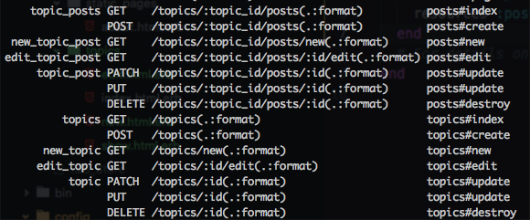

# Day 5 Lessons

## Nesting Resources

- First let's remove `optional: true` from the `Post model`.

- Now, we're going to add structure to our application.

- As you've learnt, we've created `topics`, and we've created `posts`.

- We also know that `posts` are nested (belongs to) under `topics`.

- Let's start by nesting our `posts` routes under `topics`

- Go to your `routes` and type in the following:

  ```
    resources :topics, except: [:show] do
      resources :posts, except: [:show]
    end
  ```

- We've now nested our posts url under topics, if you type `rails routes`, you'll see:

  

- We've also removed the `show url` from both `topics` and `posts`, we don't need them anymore

- Notice that your urls are now "/topics/*/posts"

- This is to allow scoping since individual topics will have their own posts.

- On top of just passing our post's `id`, we now have to pass in a new parameter called
`topic_id` when dealing with `posts`.

- Time to do a bit of refactoring for our `posts` and `topics` controllers.

- First and foremost, let's remove the `show` method and views from both controllers.

- Next, we are going to add new lines of code into your `PostsController` methods.

  ```
    class PostsController < ApplicationController

    def index
      @topic = Topic.includes(:posts).find_by(id: params[:topic_id])
      @posts = @topic.posts.order("created_at DESC")
    end

    def new
      @topic = Topic.find_by(id: params[:id])
      @post = Post.new
    end

    def create
      @topic = Topic.find_by(id: params[:topic_id])
      @post = Post.new(post_params.merge(topic_id: params[:topic_id]))

      if @post.save
        redirect_to topic_posts_path(@topic)
      else
        redirect_to new_topic_post_path(@topic)
      end
    end

    def edit
      @post = Post.find_by(id: params[:id])
      @topic = @post.topic
    end

    def update
      @topic = Topic.find_by(id: params[:topic_id])
      @post = Post.find_by(id: params[:id])

      if @post.update(post_params)
        redirect_to topic_posts_path(@topic)
      else
        redirect_to edit_topic_post_path(@topic, @post)
      end
    end

    def destroy
      @post = Post.find_by(id: params[:id])
      @topic = @post.topic

      if @post.destroy
        redirect_to topic_posts_path(@topic)
      end
    end

    private

    def post_params
      params.require(:post).permit(:title, :body)
    end
  end
  ```

- `.include(:posts)` is an `eager loading` method. This is usually used when we need to load an associated table on top of the original table.
This allows faster querying when you eventually need to retrieve a record's associations. For example, when you need to fetch all `posts` of a `topic`.

- As mentioned, since we've nested posts under topics, we can now scope to show posts relevant to the topic we've selected.

- Because of this, we have to pass `topic` into all our `link_to` and `form_for` paths as well.

- For example, instead of `<%= link_to "Show", post_path(@post) %>`, it is now `<%= link_to "Show", topic_post_path(@topic, @post) %>`

- Similarly, for your forms. It is now `<%= form_for(@post, topic_post_path(@topic, @post) ... %>)`

- One final thing, replace the `show` link for `topics` to the posts `index` instead.

- For example:

- Instead of `<%= link_to topic.title, topic_path(topic) %>`, use `<%= link_to topic.title, topic_posts_path(topic) %>`.

- This is to ensure we show the index of `posts` of the selected `topic` instead of showing the `topic` itself.

HINT:

- If you remember associations, another trick you can use is to do `@topic = @post.topic` instead of finding it via `params[:topic_id]`.
Note that this will not work if you do not have a `@post` record to begin with.
